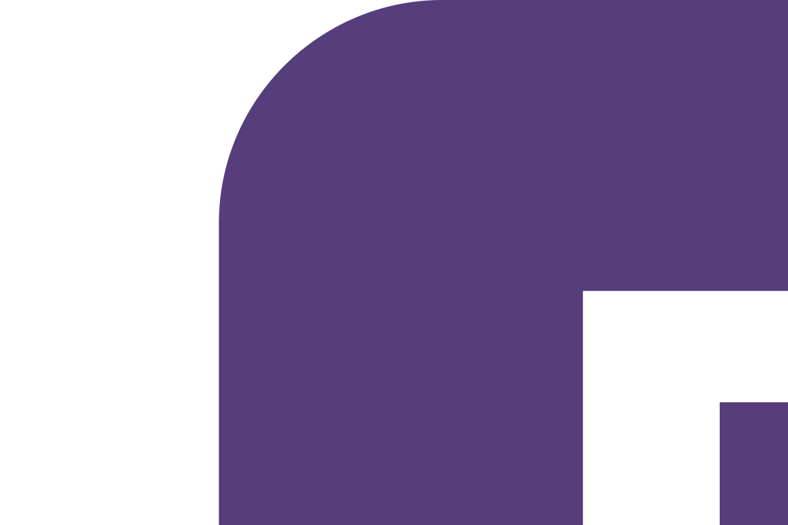
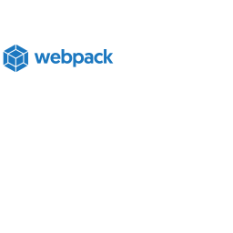
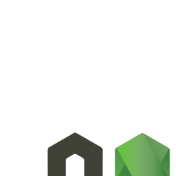
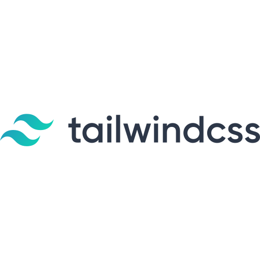

### Hi! I am Rafet 👋

## This is the very beginning of my journey to Full-Stack.

- I have learned some HTML5, CSS3, Bootstrap, JavaScript, JQuery, NodeJS, NPM, ExpressJS, EJS, SASS, Tailwind, Git, Babel, Webpack till now.
- I am currently learning React. 🧐
- I am looking forward to collaborating with other coders. 👯
- 2021 Goals: Python -> Django -> Full-Stack Developer 🥳

## My skills  

 

## Connect with me  

<!--
**techdevrafet/techdevrafet** is a ✨ _special_ ✨ repository because its `README.md` (this file) appears on your GitHub profile.

Here are some ideas to get you started:

- 🔭 I’m currently working on ...
- 🌱 I’m currently learning ...
- 👯 I’m looking to collaborate on ...
- 🤔 I’m looking for help with ...
- 💬 Ask me about ...
- 📫 How to reach me: ...
- 😄 Pronouns: ...
- ⚡ Fun fact: ...
-->
